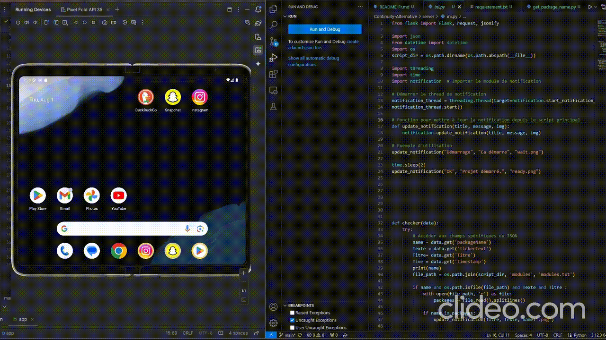

# Continuity-Alternative
Receive notifications from your social networks on an Android device and transmit them to your PC in real time. Iphone - PC alternative.

We're copying a continuous Apple feature that lets you receive notifications from your phone on Windows.

Note that this won't be possible from an iphone to a PC, but we do have a potential alternative. [here](./iOs-Iphone-user-en.md)

[demo here](./img/demo.mp4)

## How it works

We'll build an apk that reads notifications from all applications. All notifications collected will be sent to a predefined server in a local HTTP-EN frame. The server, running on a Windows machine, will display what it receives via the frames, and we'll choose which applications to display.

For the moment, these are readable http frames; in a future Maj, it will be possible to use autosigned ssl, to be used locally.

## Get Started

### Fast
For a quick launch:

- Android 7.0 or + with supported networks
- python3
- pip :
    - flask
    - json
    - Pillow
    - tkinter

pip install flask pillow

We'll install the Apk on the desired phone.

- Download application
- Install
- Configure local Windows lip where you want to receive notifications
- Change port if changed in server.

- You can test the connection once the server is launched.

On the PC side, launch the app.

- Download dependencies
- Launch the app
- Wait for startup to finish

The next time a supported network is notified, the slot is displayed with maximum opacity.

## Custom Notification

To add a custom :

- you need :
    - the package name
    - a Png image of the package

- Retrieve the package name:
    - Run `get_package_name.py`.
    - A notification is triggered 
    - Retrieve the package name

- To do this :
    - in `./serveur/modules/modules.txt` paste the package name in a new line
    - In `./serveur/images` paste the chosen image, then rename it with the package name.

Application notifications will be displayed.