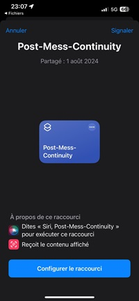
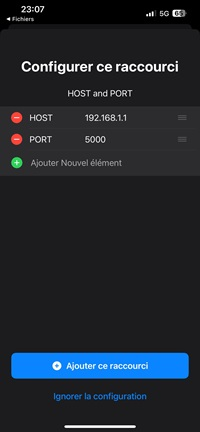
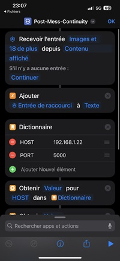
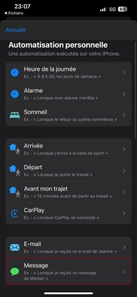
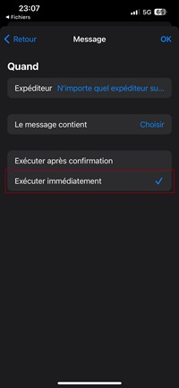
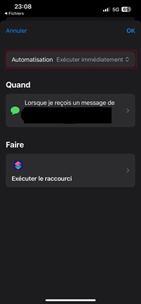
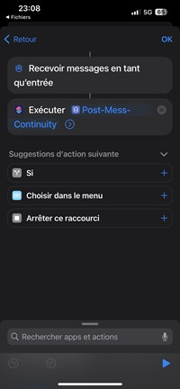

## Pour les Iphones

If you have an iphone and a PC or Mac Os, you're facing the same problem that led me to create this project.

Here are the prerequisites.

- An android device -- It is possible to use a Berry rap or an old android device.
    - An android device is required to retrieve notifications from the various social networks.
- An iphone with Maj des shorcuts and automations. (For Messages and Imessages)
    - Warning: on some ios versions, automation requires user validation, which is really nasty.
    - tests performed on iphone 13 ios < 17.0

Features and explanations

- Social network notification retrieval.

You can retrieve notifications from an Android tier, using a Berry rap or virtual machine with 512 MB RAM.
Why not on ios, because applications are in secure software and hardware environments, and without jailbreak it's impossible to read the notification center, even if you pay for an Apple license.

- Ios message retrieval.

With automation, you can choose the recipients, and when you receive a message from the selected people, a request will be sent to the server.
The sender's name is lost. I'm not a big talker by SMS or other means, so I admit I haven't pushed this side of things.

## Get Started

First, install the app on an android to retrieve social network notifications.

- Then take your iphone and download the shortcut.

    

    - Configure server and port

    

    - A preview of what you'll get: 

    

- Now we need to create the automatisaton that will launch the shortcut:
    - In `Automation` select "Receive message".

     

    - Select "Execute Immediately" otherwise the user will be asked for authorization and that's ultra gross.

    - Select the contacts you want, then leave the message blank to take everything.

    

    - Check "Execute Immediately".

    - Go to "Do".

     

    - Select a new action "Execute a shortcut" and choose the downloaded shortcut ``Post-Mess-Continuity``.

     
     
The next time a message is sent, it will be forwarded to the server and port previously configured.
it is possible to disable the automation execution patterns.