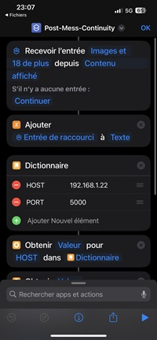
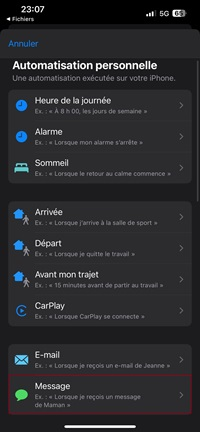
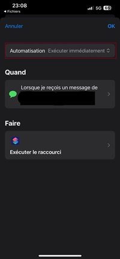
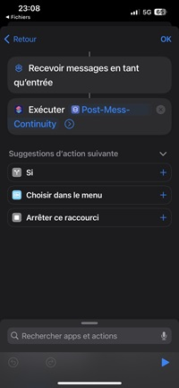

## Pour les Iphones

Si vous avez un téléphone iphone et un PC autre Mac Os vous êtes confronté à la problématique qui m'a fait créer ce projet.

C'est possible, voici les prérequis.

- Un appareil android -- Il est possible d'utiliser une rap Berry ou vieux android
    - Il est obligatoire d'avoir un appareil android pour récupérer les notifications des différents réseaux sociaux.
- Un iphone avec la Maj des shorcuts et des automatisations. (Pour les Messages et Imessages)
    - Attention sur certaines versions ios l'automatisation demande une validation par utilisateur, ce qui est vraiment infect.
    - tests effectués sur Iphone 13 ios < 17.0

Les features et explications

- Récupération des notifications des réseaux sociaux.

Depuis un android tier on va pouvoir récupérer les notifications, c'est largement possible d'utiliser une rap Berry ou machine virtuelle avec 512 Mo de RAM.
Pourquoi ne pas faire sur ios, parce que les applications sont dans des environnements sécurisés software mais aussi hardware, sans jailbreak, impossible de lire le centre de notifications, même en payant une licence apple.

- Récupération des messages Ios.

Avec une automatisation, on va pouvoir choisir les destinataires, et quand on recevra un message des personnes sélectionné, une requête sera envoyée au serveur.
On perd le nom de l'expéditeur, N'étant pas un grand parleur par SMS ou autres, j'avoue que je n'ai pas poussé ce côté-là. n'hésite pas à faire une issue, pour me donner plus de détails.

## Get Started

Dans un premier temps, installez l'application sur un android pour récupérer les notifications des réseaux sociaux.

- Ensuite prenez votre iphone, on télécharge le shortcut.

    

    - Configurez le serveur et le port

    

    - Un aperçu de ce que vous aurez : 

    

- Il faut maintenant créer l'automatisaton qui va lancer le shortcut:
    - Dans `Automatisation` choisir "Recevoir un message"

     

    - Selectionnez "``Executer Immédiatemment``" sinon on demandera l'autorisation à l'user et c'est ultra degueulasse.

    - Selectionnez les contacts voulu, laissez le message vide pour tout prendre.

    

    - Verifiez bien "``Executer Immédiatemment``"

    - Allez dans "``Faire``"

     

    - Selectionnez une nouvelle action "``Executer un raccourcis``" et on choisi le raccourcis téléchargé ``Post-Mess-Continuity``.

     
     
Au prochain message il sera transféré au serveur et port configurer précédemment.
c'est possible de désactiver les motifs d'exécution de l'automatisation.